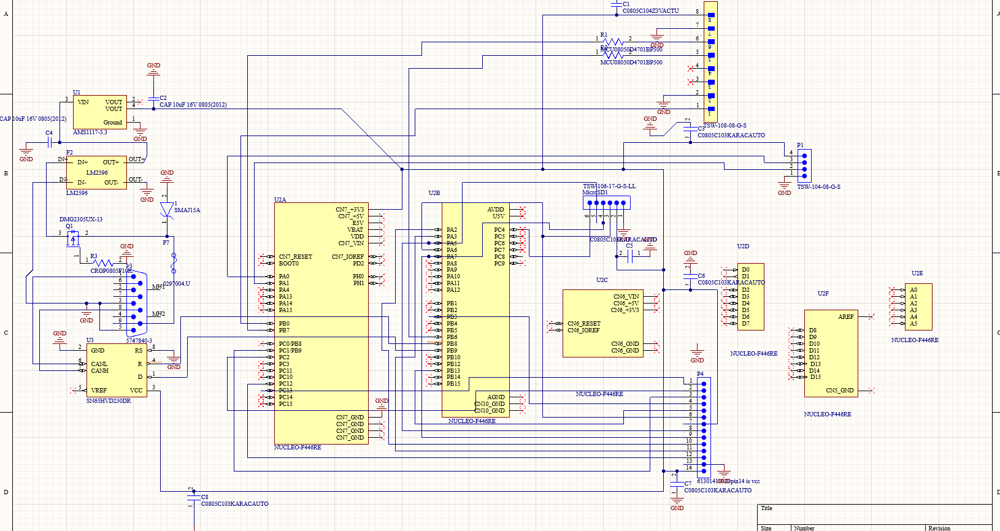
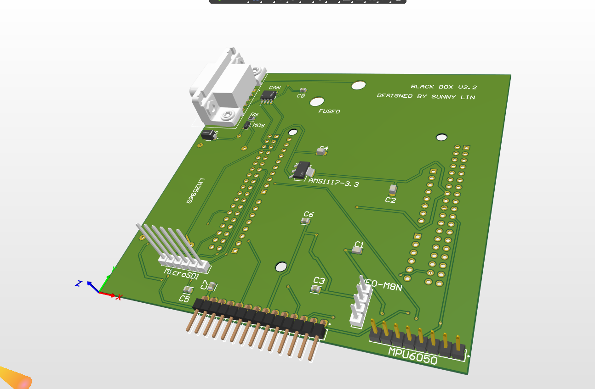
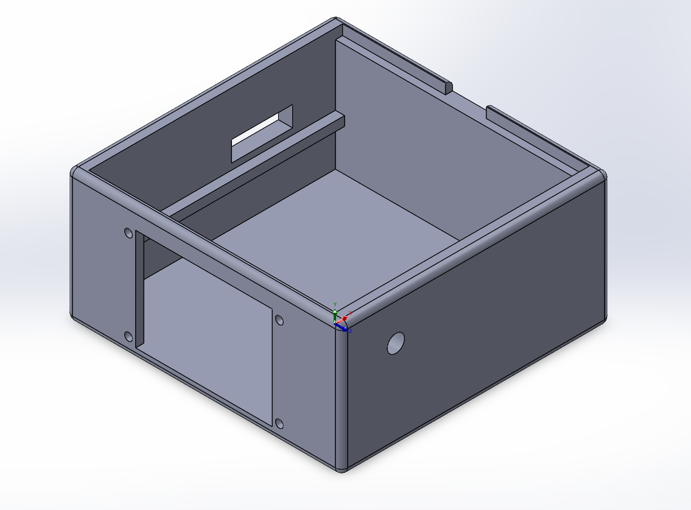
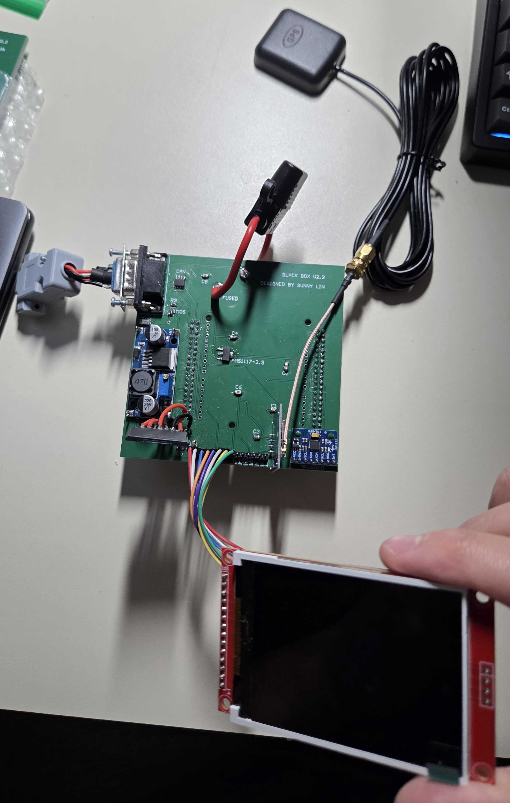
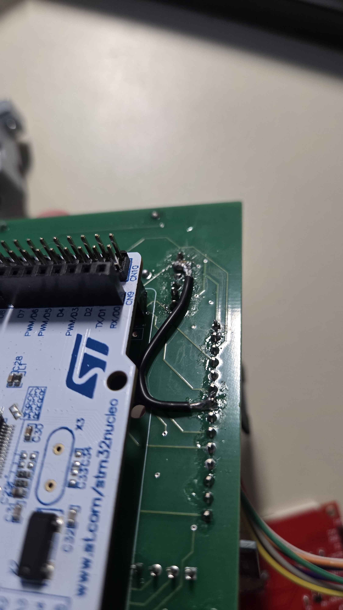
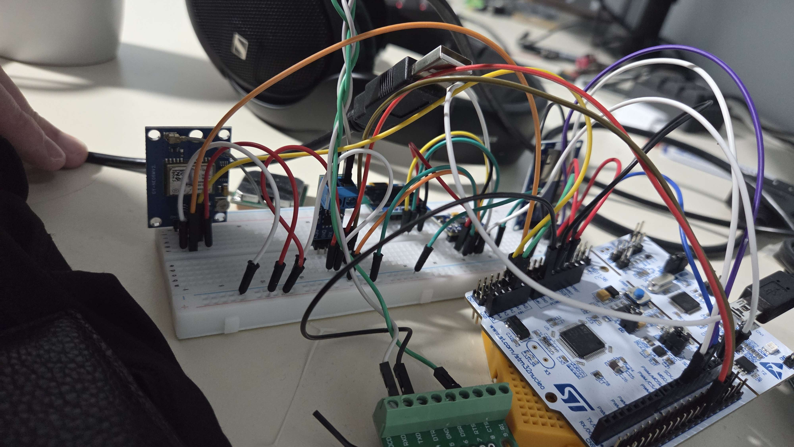
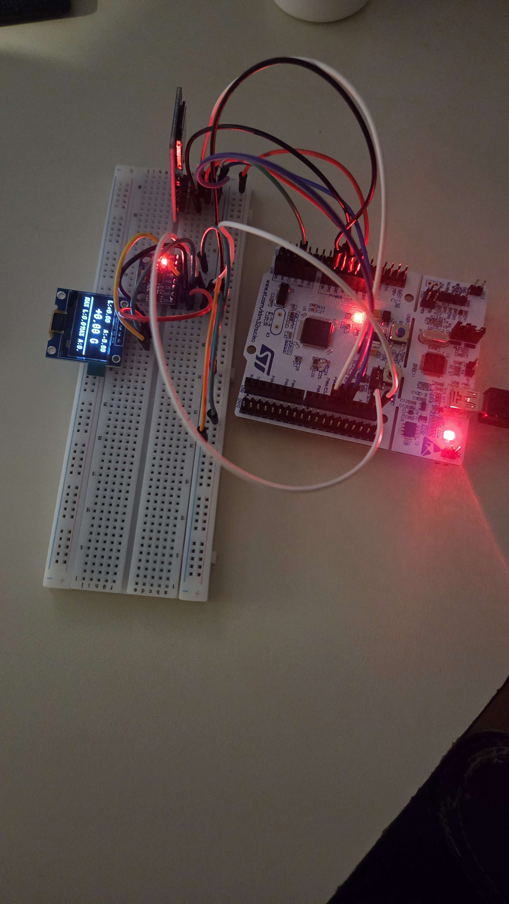
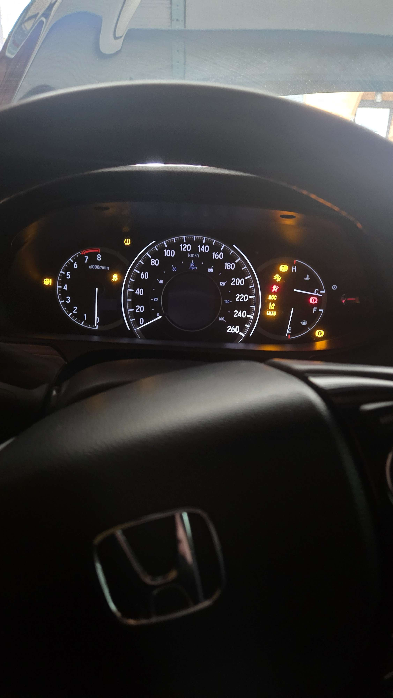
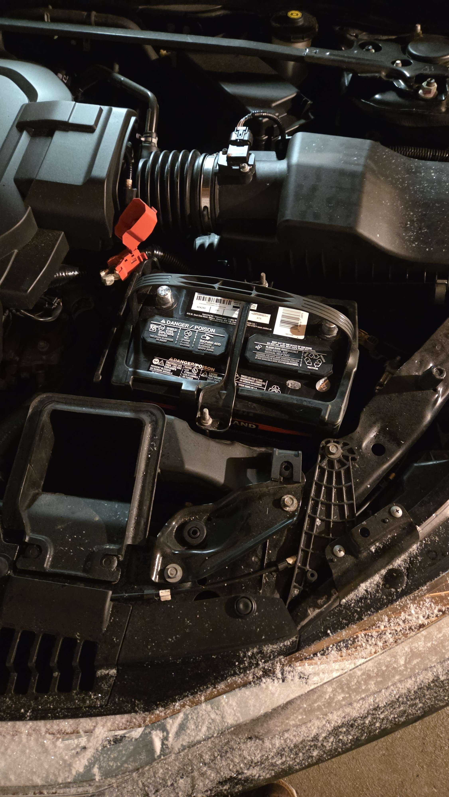

# 🏎️ Automotive Black Box V2 — Custom-PCB Vehicle Telemetry Logger

A ground-up redesign of my [Automotive Black Box](https://github.com/s-l893/Automotive-Telemetry-Data-Acquisition-System-Black-Box-) vehicle data logger. V2 moves from a breadboard prototype to a **custom Altium-designed PCB**, from a simple application loop to a **non-blocking, interrupt-driven bare-metal architecture**, and from a small OLED to a **color TFT dashboard**. It logs CAN bus traffic, GPS position/speed, and IMU acceleration to an SD card, with a firmware-enforced safety model designed around the mistakes V1 taught me.


---

## 📋 Table of Contents

- [Overview](#overview)
- [What's New in V2](#whats-new-in-v2)
- [Project Status](#project-status)
- [Gallery & Demos](#gallery--demos)
- [Hardware](#hardware)
- [Firmware Architecture](#firmware-architecture)
- [Design Decisions](#design-decisions)
- [Fault Handling](#fault-handling)
- [Log Format](#log-format)
- [Build & Flash](#build--flash)
- [Safety Notes](#safety-notes)
- [Major Issues](#major-issues)
- [Other Bring-Up Bugs](#other-bring-up-bugs)
- [UI](#ui)
- [Roadmap](#roadmap)
- [License](#license)
- [Contact](#contact)

---

## 🎯 Overview

V1 proved the concept: it logged RPM (CAN ID `0x158`), GPS, and accelerometer data from a 2016 Honda Accord V6 and was validated on real test drives. It also taught me hard lessons — most notably a floating CAN TXD line that held the bus dominant and caused ECU contention resulting in extreme battery drain ~7V.

V2 is the "do it properly" iteration:

- **Custom hardware** — schematic capture and layout in Altium Designer, fabricated by JLCPCB, hand-soldered, with real automotive input protection
- **Robust firmware** — non-blocking superloop, interrupt-driven CAN RX, lock-free ring buffers, an FSM for control flow, and a hardware watchdog
- **Safety by construction** — the CAN peripheral is configured so the logger cannot disturb the vehicle bus
- **On-device dashboard** — live data on an ILI9341 TFT
- **Generalized CAN capture** — no hardcoded Honda-specific RPM parsing; frames are captured by ID so the logger isn't tied to one vehicle

---

## 🆕 What's New in V2

| Area            | V1                            | V2                                                              |
| --------------- | ----------------------------- | --------------------------------------------------------------- |
| **Board**       | Breadboard + Nucleo           | Custom PCB (Altium → JLCPCB), OBD-II powered, protected input   |
| **Display**     | SSD1306 OLED 128×64           | ILI9341 320×240 SPI TFT                                         |
| **GPS**         | NEO-6M                        | NEO-M8N, interrupt-driven NMEA parsing                          |
| **CAN**         | Hardcoded Honda RPM (`0x158`) | Generalized per-ID frame capture                                |
| **Logging**     | Fixed 2 Hz CSV                | Per-CAN-frame rows + IMU/GPS fields, with a 200 ms sentinel row |
| **Reliability** | Fuse + graceful degradation   | Watchdog, fault flags, soft/hard fault split, silent-mode CAN   |
| **Shutdown**    | Manual (button / unplug)      | Inferred from CAN-bus silence (no voltage-sense circuit needed) |

---

## 📊 Project Status

| Subsystem                         | Status                                                                                                                                                                    |
| --------------------------------- | ------------------------------------------------------------------------------------------------------------------------------------------------------------------------- |
| CAN RX → ring buffer → SD logging | ✅ Validated end-to-end on hardware                                                                                                                                       |
| FatFs SD driver (SPI)             | ✅ Hand-written `user_diskio.c`; validated on breadboard                                                                                                                  |
| IMU (MPU6050)                     | ✅ Driver complete and hardware-validated, integrated into log rows                                                                                                       |
| GPS (NEO-M8N)                     | ✅ Driver validated; RTC sync; lat/lon/speed in CSV                                                                                                                       |
| Display (ILI9341)                 | ✅ Hand-written driver with software landscape rotation                                                                                                                   |
| Display UI                        | ✅ Complete, however still has some empty spots due to the sheer difficulty of finding the correct CAN PID code                                                           |
| Touch (XPT2046)                   | ⛔ Driver implemented (tap/swipe classification), but the touch hardware isn't cooperating — and I realized there isn't a good use for touch on this dash, so it's unused |
| Fault management + IWDG           | ✅ Implemented                                                                                                                                                            |
| CAN signal decoding               | 🟡 Raw frames are logged as-is; only signals with a reliable definition are decoded for the dashboard (the rest are blank — see [Design Decisions](#design-decisions))    |
| Gear indicator                    | ✅ Solved without CAN — derived from the RPM/wheel-speed ratio (see [Design Decisions](#design-decisions))                                                                |
| CAN bus-off recovery              | 🟡 Code written, not yet validated with a forced bus-off                                                                                                                  |

**Resource usage (STM32F446RE, with the UI in place):**

| Region | Used     | Total  | Usage   |
| ------ | -------- | ------ | ------- |
| RAM    | 11.26 KB | 128 KB | 8.80 %  |
| Flash  | 75.83 KB | 512 KB | 14.81 % |

Plenty of headroom left.

---

## 📸 Gallery & Demos

> More pictures/videos coming soon after full assembly and recordings.

### The Board

|                                                                                            |                                                                            |
| ------------------------------------------------------------------------------------------ | -------------------------------------------------------------------------- |
| <br>_Schematic (Altium, may differ with PCB)_ | <br>_PCB layout_                |
| <br>_3D view_                                  | <br>_CAD model_                            |
| <br>_Assembled w/o case_                | <br>_Assembled with case_ |

### The Dashboard


_On-device dashboard running on the ILI9341_

🎬 **Dashboard demo:** [▶️ Watch the video](docs/media/dash-demo.mp4)

### In the Car


🎬 **Test drive:** [▶️ Watch the video](docs/media/test-drive.mp4)

### Bring-Up & Debugging

|                                                                                                |                                                                                  |
| ---------------------------------------------------------------------------------------------- | -------------------------------------------------------------------------------- |
| <br>_Saleae capture of SD card init_ | <br>_IMU `WHO_AM_I` handshake_ |
| <br>_Bodge wire connecting SPI1 SCK_                       | <br>_Custom DB9 crossover cable_    |
| <br>_The fuse doing its job_                         | <br>_Bench setup_                      |

### V1 (For Reference)

The original breadboard-and-Nucleo build this project grew out of. Full writeup: [Automotive-Telemetry-Data-Acquisition-System-Black-Box-](https://github.com/s-l893/Automotive-Telemetry-Data-Acquisition-System-Black-Box-).

|                                                                                           |                                                                                  |
| ----------------------------------------------------------------------------------------- | -------------------------------------------------------------------------------- |
| <br>_Breadboard + Nucleo_                        | <br>_SSD1306 OLED readout_             |
| <br>_Python-generated RPM/G-force heatmap_ | <br>_Installed for a test drive_ |
| <br>_Vehicle CAN Bus OFF due to < 9V_                     | <br>_Was not cheap_                        |

<!--
Tip: to embed a video directly on GitHub, drag and drop the .mp4 into the README
editor on github.com — it generates an inline-playable link. Otherwise, link to
YouTube or use a thumbnail image that links to the video.
-->

---

## 🔧 Hardware

### Components

| Component            | Part                            | Interface     | Purpose                                                                     |
| -------------------- | ------------------------------- | ------------- | --------------------------------------------------------------------------- |
| **MCU**              | STM32F446RE (Nucleo-64)         | —             | Main processor                                                              |
| **CAN transceiver**  | SN65HVD230                      | CAN1          | Vehicle bus interface                                                       |
| **IMU**              | MPU6050                         | I²C1          | Acceleration (accel-only in use)                                            |
| **GPS**              | NEO-M8N                         | UART4 @ 9600  | Position, speed, time (NMEA 0183)                                           |
| **Display**          | ILI9341 (SPI TFT)               | SPI1          | Dashboard / status                                                          |
| **Touch controller** | XPT2046 (on the display module) | SPI2          | Driver implemented but **not used** — see [Project Status](#project-status) |
| **Storage**          | microSD (FAT32 via FatFs)       | SPI1 (shared) | Session logging                                                             |
| **Buck converter**   | LM2596                          | —             | 12 V → ~5 V                                                                 |
| **LDO**              | AMS1117-3.3                     | —             | 5 V → 3.3 V                                                                 |
| **Debug**            | ST-LINK VCP                     | USART2        | Serial debug output                                                         |

Display `DC` / `RESET` are on `PA2` / `PA3`. The display and SD card share SPI1; each driver re-asserts its own SPI mode at the start of every transaction, so they can coexist without a manual bus-reconfiguration step.

### Power & Protection

```
OBD-II 12V ─► [ 2A blade fuse │ SMAJ15A TVS │ P-MOSFET reverse-polarity ] ─► LM2596 buck ─► ~5V rail ─► AMS1117-3.3 ─► 3.3V
```

- **Overcurrent protection:** 2 A automotive blade fuse — it has **saved me many times during board bring-up**
- **Reverse-polarity protection:** P-channel MOSFET
- **Transient protection:** SMAJ15A TVS diode
- **Decoupling** on all ICs
- **CAN termination:** intentionally omitted — the vehicle bus is already terminated

> ⚠️ **Known limitation (this board revision):** there is no protection between the LM2596 output and the STM32/ST-LINK rail. Powering the board over USB while the 12 V input is dead can backfeed the buck converter and damage it. See [Safety Notes](#safety-notes).

### PCB

Designed in **Altium Designer**, fabricated by **JLCPCB**, and hand-soldered. Two revisions have been built; see [Major Issues](#major-issues) for what each revision taught me.

---

## 🏗️ Firmware Architecture

V2 is a **bare-metal, non-blocking superloop**. Nothing in the main loop waits on a peripheral; ISRs only move bytes and set flags, and the loop consumes them.

```
                ┌──────────────────────── ISRs ───────────────────────┐
  CAN RX (FIFO) ─► can_ring_buffer (SPSC)                              │
  UART4 RX (1B) ─► NMEA line buffer ─► nmea_parse_buffer + ready flag  │
                └──────────────────────────────────────────────────────┘
                                   │
                                   ▼
 ┌────────────────────────── Superloop ──────────────────────────┐
 │  IWDG refresh                                                 │
 │  fsm_sys (5-state system FSM)                                 │
 │    ├─ imu_read()            (I²C poll)                        │
 │    ├─ GPS_Driver_Update()   (parse RMC, fault timeout)        │
 │    ├─ fault checks          (CAN silence, GPS, IMU)           │
 │    ├─ SD_Logger_DrainCAN()  (ring buffer → CSV → FatFs)       │
 │    └─ display update        (dashboard rendering)             │
 └───────────────────────────────────────────────────────────────┘
```

### Modules

| Module                 | Responsibility                                                            |
| ---------------------- | ------------------------------------------------------------------------- |
| `ring_buffer.c/.h`     | Generic single-producer/single-consumer ring buffer                       |
| `can_ring_buffer.c/.h` | CAN-frame ring buffer filled from the RX interrupt                        |
| `can_handler.c/.h`     | CAN configuration, RX handling, silence timeout, bus-off recovery         |
| `fsm_sys.c`            | Five-state system finite state machine                                    |
| `fault.c/.h`           | Fault flags and severity handling                                         |
| `sd_logger.c/.h`       | FatFs lifecycle, filename generation, CSV row formatting and drain        |
| `user_diskio.c`        | Hand-written SD-over-SPI FatFs disk driver                                |
| `imu`                  | MPU6050 init, `WHO_AM_I` handshake, calibration, offset-corrected reads   |
| `gps_driver.c/.h`      | Interrupt-driven NMEA receive, RMC parsing, decimal-degree conversion     |
| `display.c`            | ILI9341 init, windowing, chunked fills, logical-coordinate rotation layer |
| `touch_driver.c/.h`    | XPT2046 reads and tap/swipe classification (implemented, **unused**)      |

---

## 🧠 Design Decisions

**Bare-metal superloop, no RTOS.** The workload, which is a handful of periodic polls plus interrupt-fed buffers doesn't justify scheduler overhead or the concurrency hazards that come with it. I'm saving the RTOS for my FOC motor-controller project, where hard real-time scheduling actually matters.

**CAN peripheral can't disturb the vehicle.** After V1's bus-flood incident, the CAN handler enforces a silent mode in firmware so the logger never drives the bus, independent of what the wiring does.

**CAN passive listener over active CAN PID requests.** I heavily considered changing this project to do both at the last minute, due to the new finding that ATF temps and VCM (Variable Cylinder Management) engine status may require the MCU to send requests to the ECU. I ultimately chose not to because of the low reliability of my CAN PID source.

**Shutdown inferred from CAN silence.** Instead of adding a voltage-sense/ADC circuit, the firmware treats 2500 ms without a CAN frame as ignition-off and shuts down the log cleanly.

**Soft vs. hard faults.** Core CAN→SD logging is what matters. If the IMU fails to initialize, that's a _soft_ fault: logging continues without it rather than halting the whole system.

**Sentinel rows keep sensor data flowing.** When the CAN bus is quiet, a sentinel row (`id = 0xFFFF`, `dlc = 0`) is emitted every 200 ms so GPS and IMU data still get logged.

**ISR ↔ main-loop handoff via flag + stable copy.** The GPS ISR assembles a line in a fixed 85-byte buffer, copies the completed sentence into a separate parse buffer, then resets its index and sets a ready flag that the consumer clears. The same producer/consumer pattern fixed the CAN flag bug described below.

**Parse RMC only.** RMC alone carries fix validity, so it's sufficient for position, speed, and time without the extra parsing cost of GGA.

**Software rotation for the display.** The specific ILI9341 clone on my module ignores the documented `MADCTL` MV (row/column exchange) bit, so landscape is achieved in software: a `LCD_SetWindow_Logical()` layer maps a 320×240 logical space onto the panel's native 240×320 addressing.

**No touch input.** I wrote a touch driver (tap/swipe classification), but the touch hardware wasn't cooperating, and I realized there isn't really a good use for touch on a dash you glance at while driving. The driver stays in the tree as an unused module.

**Gear derived from RPM/speed ratio, not CAN.** Reliable CAN signal definitions for the transmission's selected gear are impossible to find without a manual shifting mode on the 9.5th gen Accord V6 Sedan, as it is never broadcast on the F-CAN bus, so gear is computed instead: `ratio = engine RPM / wheel speed`, and each gear has its own identification window for `ratio`. The windows come from the gearbox's total reduction (transmission ratio × final drive) at each gear:

| Gear | Transmission Ratio | Total Reduction (× final drive) | Typical Ratio | Identification Window |
| ---- | ------------------ | ------------------------------- | ------------- | --------------------- |
| 1st  | 3.359              | 13.238                          | ≈ 107.5       | R ≥ 85.0              |
| 2nd  | 2.095              | 8.256                           | ≈ 67.1        | 55.0 ≤ R < 85.0       |
| 3rd  | 1.485              | 5.852                           | ≈ 47.6        | 40.0 ≤ R < 55.0       |
| 4th  | 1.065              | 4.197                           | ≈ 34.1        | 29.0 ≤ R < 40.0       |
| 5th  | 0.754              | 2.971                           | ≈ 24.2        | 21.0 ≤ R < 29.0       |
| 6th  | 0.556              | 2.191                           | ≈ 17.8        | R < 21.0              |

This sidesteps the CAN-PID reliability problem entirely for gear display, at the cost of needing both RPM and an accurate wheel-speed signal at the same time.

The ratio logic only runs while the transmission is in D or S range. Below 5.0 (speed unit), it reports gear 1 to cover creeping and standing starts:

```c
if (speed < 5.0f) {
    gear = 1U; /* creeping / stopped in D/S */
} else {
    ratio = rpm / speed;
    if (ratio >= 85.0f) {
        gear = 1U;
    } else if (ratio >= 55.0f) {
        gear = 2U;
    } else if (ratio >= 40.0f) {
        gear = 3U;
    } else if (ratio >= 29.0f) {
        gear = 4U;
    } else if (ratio >= 21.0f) {
        gear = 5U;
    } else {
        gear = 6U;
    }
}
```

In any gear apart from D/S, the gear/subgear field is hidden entirely rather than fed through this logic — otherwise a stationary or coasting RPM/speed pair would bucket into a meaningless "gear."

---

## 🚨 Fault Handling

| Fault                | Trigger                                            | Severity | Effect                                          |
| -------------------- | -------------------------------------------------- | -------- | ----------------------------------------------- |
| **CAN silence**      | No CAN frame for 2500 ms                           | —        | Interpreted as ignition-off → clean stop        |
| **GPS fault**        | No NMEA line at all for 1.5 s (module not talking) | Soft     | Distinct from "alive but no fix" (`gps.locked`) |
| **IMU init failure** | `WHO_AM_I` mismatch / no response                  | Soft     | Logging continues without IMU data              |
| **Touch fault**      | Touch held/stuck for 12 s (touch driver only)      | Soft     | Only relevant if touch is enabled               |
| **Watchdog (IWDG)**  | Main loop stalls                                   | Hard     | MCU reset                                       |

The GPS timeout is stamped in the UART RX ISR on every complete line — _before_ sentence-type filtering — so it answers "is the module talking?" rather than "does it have a lock?".

---

## 📝 Log Format

Sessions are logged as CSV to a FAT32 SD card. Each row contains the CAN frame fields, followed by GPS fields (latitude, longitude, speed) and IMU fields (Ax, Ay, Az). GPS and IMU columns appear in the same order in both row types:

- **CAN-frame rows** — written per received frame
- **Sentinel rows** — `id = 0xFFFF`, `dlc = 0`, written every 200 ms of CAN silence so GPS/IMU data keep flowing

> **Toolchain note:** float formatting via `snprintf` requires newlib-nano float support — add `-u _printf_float` under _MCU GCC Linker → Miscellaneous_.

---

## 🛠️ Build & Flash

**Requirements:** STM32CubeIDE, STM32CubeMX (bundled), an ST-LINK (on the Nucleo), a serial terminal (PuTTY etc.) for debug output on USART2 (pre-solder bridge modification for PA2 & PA3).

1. **Clone the repository**

   ```bash
   git clone https://github.com/s-l893/<your-v2-repo>.git
   cd <your-v2-repo>
   ```

2. **Open in STM32CubeIDE** — _File → Open Projects from File System_, select the project folder.

3. **Check the CubeMX configuration**
   - Enable the **UART4 global interrupt** in NVIC (GPS reception depends on it)
   - Confirm SPI1 (display + SD) is enabled

4. **Add the linker flag** `-u _printf_float` (see [Log Format](#log-format)).

5. **Build** (Ctrl+B) and **flash** (Run → Debug, F11).

6. **Open a serial terminal** on the ST-LINK virtual COM port to watch debug output.

---

## ⚠️ Safety Notes

- **Keep the fuse in.** The 2 A blade fuse has saved me many times during board bring-up. Never bypass it.
- **Power via USB only on the current board revision.** Because of the missing output-side protection on the LM2596, do **not** have USB and the 12 V OBD-II input live at the same time. Until the fix lands, the OBD/CAN transceiver side is left unpowered/unwired during bench work.
- **Planned fix:** a correctly oriented diode between the LM2596 output and the STM32 rail to diode-OR the two power sources.
- **The logger must never transmit on the vehicle bus.** Keep the firmware's CAN silent-mode configuration intact.
- Only use on vehicles you own or have permission to work on, and follow local regulations around OBD-II access.

**This is an educational project. The author assumes no liability for damage, injury, or legal issues arising from its use.**

---

## 🔥 Major Issues

Building V2 did not go smoothly. These are the big ones.

### PCB & Hardware

- **DB9 port incorrectly wired (rev 2).** The DB9 footprint was mirrored, so the board couldn't plug into the cable as designed. Fix: I built a **custom DB9 crossover cable**.
- **Fuse holder hole too small (rev 1).** The drill hole for the fuse holder was undersized on the first revision.
- **Failed solder attempt on the first PCB.**
- **No diode for reverse-current protection on the LM2596.** Nothing sits between the buck converter's output and the STM32/ST-LINK rail, so powering over USB backfeeds the converter. The fix (a diode to OR the two supplies) is identified but not yet implemented on this revision — for now I power over USB only.
- **PA2/PA3 interfering with USART2.** Solder bridges on the Nucleo tie these pins to USART2, which fought the display's DC/RESET lines. Fix: disable USART2 and add a bus-prep routine that releases those pins before the display uses them. **Lesson:** don't pick pins that silently double as other peripherals' defaults.

### SD Card Saga

- **`CMD0` returning `0xFF`.** Debugged with a **Saleae logic analyzer**. An early false lead was that the card wasn't physically wired in during captures, so MISO was just being held high by the MCU's internal pull-up. The eventual real cause was a **bus conflict in the card init sequence between `CMD55` and `CMD41`**.
- **MISO stuck low with the SPI SD module.** The module's level-shifting buffer (VHCT125) needs 4.5–5.5 V but was being fed from the 3.3 V regulator output. Fix: cut the trace and bodge-wire the buffer's VCC to the raw ~5 V rail. **Lesson:** read the datasheet for every chip hiding on a "module."
- **microSD SCK bodge wire.** The SCK line was intermittent (likely PCB damage or a lifted pad), so it needed a bodge wire — which eventually **broke after many re-solder attempts**. This was after originally using an SPI SD module.
- **Soldered a microSD-to-SD card adapter directly** to the board as a workaround.

### Debugging

- **IMU `WHO_AM_I` handshake failed.** Tracked down with the logic analyzer; the fix was **reseating a wire**.

### Vehicle & CAN

- **V1: many of the car's control modules responding with dominant bits, draining the battery.** A floating CAN TXD line held the bus dominant, causing ECU contention and extreme battery drain (~7 V). This directly shaped V2's firmware-enforced silent CAN mode.
- **Very hard to find accurate manufacturer CAN information.** Manufacturer-specific CAN IDs, signal layouts, and PIDs aren't standardized or publicly documented, so figuring out what a given ID or request means takes serious digging. This is the reason for the empty spots on the dashboard and for staying a passive listener.

### Parts & Logistics

- **AliExpress sent me a belt instead of my GPS.** 🙃

---

## 🐛 Other Bring-Up Bugs

Smaller (but still educational) issues:

| Problem                             | Root cause                                                                                                                   | Fix / Lesson                                                                                                    |
| ----------------------------------- | ---------------------------------------------------------------------------------------------------------------------------- | --------------------------------------------------------------------------------------------------------------- |
| **Rev 1: blown fuses + smoke**      | LM2596 buck module had an internally failed switch — near-0 Ω short between IN+ and OUT+                                     | Parked rev 1; continued on breadboard + bare Nucleo. Always check a power module before mating it to the board. |
| **Rev 1: I²C SDA/SCL swapped**      | Hardware I²C1 pin roles are fixed in silicon; I routed them crossed                                                          | Cut traces, cross with jumper wires. Ultimately led to PCB redesign. **Check AF pin roles before routing.**     |
| **Altium / fab issues**             | TVS orientation error, CAN transceiver `VREF` miswired, vault-component locking, binary-format drill file rejected by JLCPCB | Fixed in schematic/library; used a local integrated library; exported ASCII drill files                         |
| **Display landscape broken**        | ILI9341 clone ignores `MADCTL` MV bit                                                                                        | Software coordinate-rotation layer, verified with a 4-corner test                                               |
| **CAN silence timeout never fired** | `can_frame_received_flag` was never cleared                                                                                  | Clear the flag on consumption — same pattern later reused for GPS                                               |
| **GPS stalled / garbled**           | Wrong UART handle, bad `strtok` delimiters, no overflow recovery, non-RMC sentences fed to parser                            | Correct `huart4`, RMC filter, overflow recovery, UART-instance guard in the shared RX callback                  |

**Big takeaways:** check which peripherals a pin silently doubles as _before_ routing it, read the datasheet for every chip hiding on a "module," and always put a fuse in the power path.

---

## 🖥️ UI

Dash-style layout on the 320×240 ILI9341:

- Transmission / engine coolant temperature
- Gear (derived from RPM/speed ratio, not CAN — see [Design Decisions](#design-decisions)) + RPM, with shift lights near redline
- G-force (lateral, longitudinal) number display
- Max acceleration / cornering stats
- Fault / status box
- GPS locked/unlocked
- VCM active/inactive

There is no touch input — the dash is glance-only by design (see [Design Decisions](#design-decisions)).

> Some readouts still have empty spots because accurate CAN definitions for them are very hard to find.

---

## 🔮 Roadmap

**Firmware**

- [ ] Fill in the remaining CAN signal decoding (map the raw bytes of known IDs to real values), configurable rather than hardcoded
- [ ] Validate CAN bus-off recovery with a deliberately forced bus-off
- [ ] Display / SD SPI bus arbitration under real load

**Hardware**

- [ ] Diode-OR between LM2596 output and STM32 rail (fix the USB backfeed)
- [ ] Resolve the remaining SD interface fault on the rev-2 PCB
- [ ] Next PCB revision incorporating all bodge-wire fixes and an overall more space-efficient design

**Stretch**

- [ ] On-device graphing / session review
- [ ] Standard OBD-II PID support (active requests)
- [ ] Multi-vehicle CAN configuration

---

## 📄 License

MIT — see [LICENSE](LICENSE).

---

## 📧 Contact

**Sunny Lin** — sunnylin893@gmail.com

V1 repository: [Automotive-Telemetry-Data-Acquisition-System-Black-Box-](https://github.com/s-l893/Automotive-Telemetry-Data-Acquisition-System-Black-Box-)
